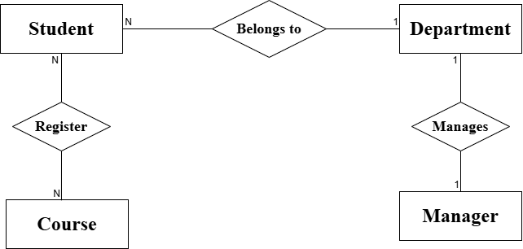

# Join And Navigation Property

## 1. Navigation Property

**Definition:**

- It is a property __provided by EF Core__ which you can add
  in your entity class and it __work as pointr to another related entity__.
- EF Core automatically uses the __foreign key relationships__ to load related 
  data through this property.

**Purpose:**

- It define relationships between entities, such as:
  - One-to-One (e.g., Department ↔ Manager).
  - One-to-Many (e.g., Student ↔ Department).
  - Many-to-Many (e.g., Student ↔ Course).

- It allows you to navigate from one entity to another related entity without
  having to write a join query.

**Why It's Important:**

- It simplifies data access by allowing you to navigate through related entities
  without writing complex queries.
- Great for readability, less code, and automatic relationship handling.
- Perfect when working within your domain model and you don’t need a custom join.

**Disadvantage:**

- It can lead to performance issues if not used carefully, especially with large datasets.
- EF Core decides join behavior so you will not be having full control over the
  join operation.
- Only works for relationships defined in the EF model.

**Usage:**

- To directly access related entity data through object references (set and get).
````csharp
var student = _context.Students.First();
Console.WriteLine(student.department.DepartmentName); // direct access to related entity ...

````
- To perform query operations (e.g., filtering, sorting) on related entities.

  - In-memory queries → When the related data is already loaded into 
	application memory (operates on objects).

````csharp
var students = _context.Students.ToList(); // Loads all
var filtered = students
    .Where(s => s.Department.DepartmentName == "IT")
    .ToList(); // Runs in memory
````

   - Database queries → When the related data is accessed in a way that 
	EF Core translates into a SQL query and executes it directly 
	in the database (operates on entities in the database).
	
````csharp
var students = _context.Students
    .Where(s => s.Department.DepartmentName == "IT")
    .ToList(); // Runs in DB

````

## 2. Join

**Definition:**

- A method in LINQ used to combine data from two or more sequences (tables/collections) based on matching key values.
- In EF Core, Join translates directly into a SQL JOIN statement when querying a database.

**Purpose:**

- To relate data from different sources when:
  - No navigation property exists between entities.
  - You want full control over the join condition.
  - You need to join on fields that are not part of an EF Core relationship.

**Common join types:**

- Inner Join – Returns only matching records.
- Group Join – creates a group of related items for each element in the first collection/sequence.
- Left Outer Join – Returns all records from the first sequence, even if no match exists in the second.

**Why It's Important:**

- Gives you full control over how two datasets are related.
- Useful for performance tuning — only the needed fields/records are retrieved.
- Can be applied to unrelated tables or tables without foreign key constraints.

**Disadvantage:**

- More detailed and less readable than navigation properties.
- Requires manually specifying join keys.
- If not written carefully, can be harder to maintain and debug.

**Uasge:**

- Inner join

````csharp
// Inner join between Students and Departments ...
var result = _context.Students
    .Join(_context.Departments,
          student => student.DepartmentId,
          department => department.DepartmentId,
          (student, department) => new
          {
              StudentName = student.Name,
              DepartmentName = department.DepartmentName
          })
    .ToList();
````
- Left outer join

````csharp
// Left outer join between Students and Departments ...
var leftJoin = from dept in _context.Departments
               join stud in _context.Students
               on dept.DepartmentId equals stud.DepartmentId
               into studentGroup
               from student in studentGroup.DefaultIfEmpty()
               select new
               {
                   Department = dept.DepartmentName,
                   StudentName = student != null ? student.StudentName : "No Students"
               };

foreach (var item in leftJoin)
{
    Console.WriteLine($"Department: {item.Department} - Student: {item.StudentName}");
}
````

- Group join

````csharp
// Group join between Students and Departments ...
var groupJoin = from dept in _context.Departments
                join stud in _context.Students
                on dept.DepartmentId equals stud.DepartmentId
                into studentGroup
                select new
                {
                    Department = dept.DepartmentName,
                    Students = studentGroup
                };

foreach (var item in groupJoin)
{
    Console.WriteLine($"Department: {item.Department}");
    foreach (var student in item.Students)
    {
        Console.WriteLine($"  - {student.StudentName}");
    }
}
````

- Join with filtering 

````csharp
// Join with filtering ...
var filtered = _context.Students
    .Join(_context.Departments,
          s => s.DepartmentId,
          d => d.DepartmentId,
          (s, d) => new { s.Name, d.DepartmentName })
    .Where(x => x.DepartmentName == "IT")
    .OrderBy(x => x.Name)
    .ToList();

````

## Summary

**Navigation Properties vs. Joins in LINQ**

|Feature                         |Navigation Properties           |Explicit LINQ Join                       |
|--------------------------------|--------------------------------|-----------------------------------------|
|Ease of Use                     |Shorter, more readable          |More verbose                             |
|Control                         |EF decides join type            |You decide join type                     |
|Requires Relationship in Model? |Yes                             |No                                       |
|Use Case                        |Simple related data fetching    |Complex joins, multiple unrelated tables |
|SQL Generated                   |EF generates join automatically |You write join conditions yourself       |

**System ERD**

